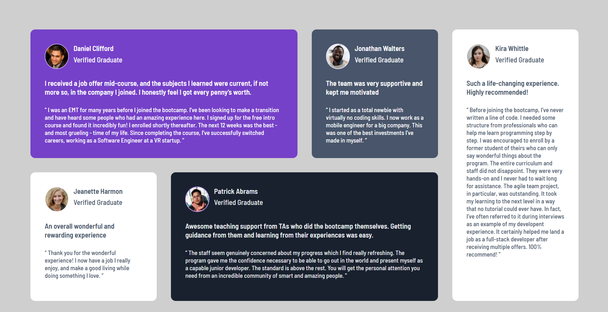

# Frontend Mentor - Testimonials grid section solution

This is a solution to the [Testimonials grid section challenge on Frontend Mentor](https://www.frontendmentor.io/challenges/testimonials-grid-section-Nnw6J7Un7). Frontend Mentor challenges help you improve your coding skills by building realistic projects. 

## Table of contents

- [Overview](#overview)
  - [Screenshot](#screenshot)
  - [Links](#links)
- [My process](#my-process)
  - [Built with](#built-with)
  - [What I learned](#what-i-learned)
  - [Continued development](#continued-development)

## Overview

### Screenshot

### Links

- Live Site URL: [This first version of this solution](https://oliviamodesto.github.io/Frontend_Mentor_Testimonial_grid/)

## My process

### Built with

- CSS
- Flexbox
- CSS Grid
- Mobile-first workflow

### What I learned

This project allowed me to practice concepts I was already familiar with.

### Continued development

The CSS code could be further refined.